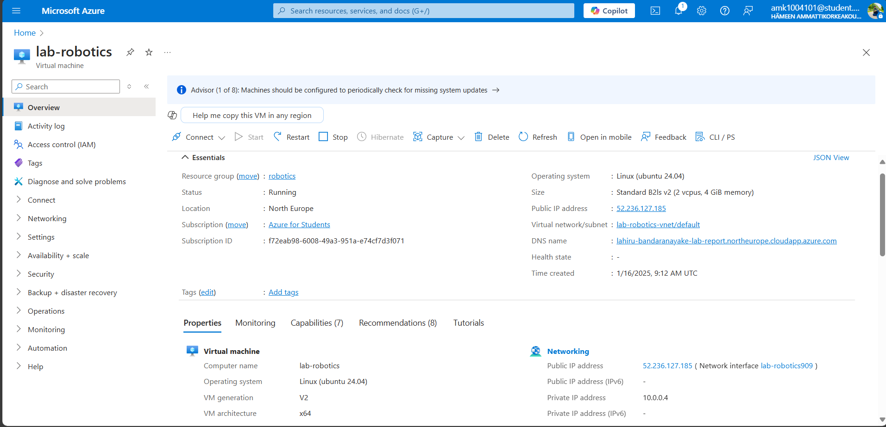
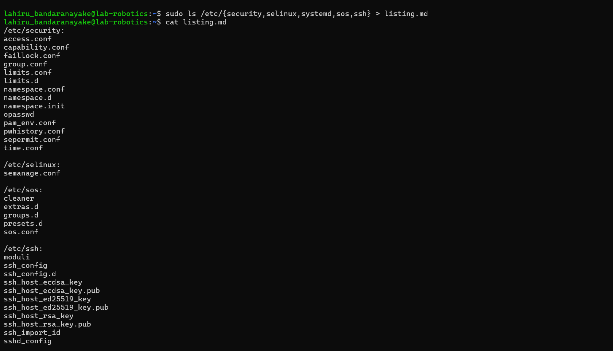
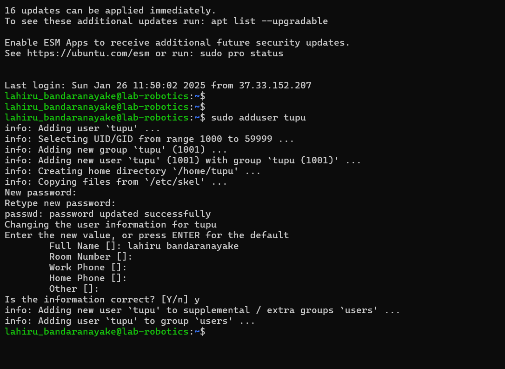
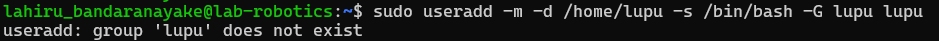
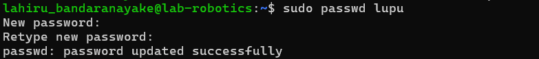
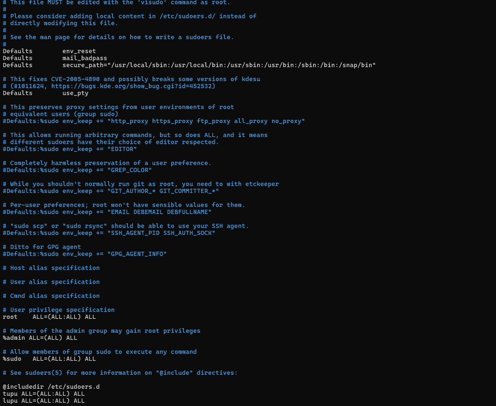
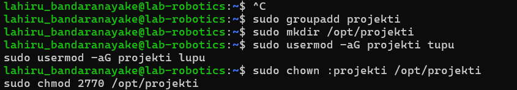
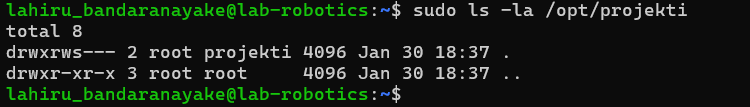

# hamk_linux_management
hamk_linux_management
## Assingment 1
### Azure Virtual Machine Setup
#### I added my HAMK student email to my personal GitHub account by following these two steps:
-I accessed the Settings
-I added the email under the Emails section.

### Azure Account Setup
- Created Azure account using HAMK student email at portal.azure.com
- Activated Azure for Students subscription for additional credits

### Virtual Machine Creation
- Image: Ubuntu Server 24.04 LTS gen 2 (Canonical)
- Name: Ubuntu1-tja-NEur-B1s
- Size: Standard_B2ls_v2
- Authentication: SSH key
- Network: New resource group and subnet created
- Security: Configured to allow SSH traffic from specified IP



### SSH Connection Setup with PuTTY
Converting .PEM to .PPK
- Launched PuTTYgen from Start menu
- Selected RSA as the key type
- Clicked 'Load' and changed file filter to 'All Files'
- Located and selected the .pem file from Azure
- Clicked 'Save private key'
- Confirmed saving without passphrase
- Saved the converted key with .ppk extension


### Establishing SSH Connection
- Opened PuTTY
- Entered VM's public IP address in the Host Name field
- Navigated to Connection > SSH > Auth
- Browsed and selected the converted .ppk key file
- Clicked 'Open' to start the session
- Successfully connected to the VM using the specified username

Connection Verification
- Successfully logged into the Ubuntu VM shell
- Verified system access and basic functionality
- System settings left at default as per instructions

Notes
- VM created according to Microsoft Azure course specifications
- All security best practices followed
- SSH key authentication used for enhanced security


## Assignment_2: List and append

Select five level 2 directories (two levels deep) and save their contents in a file named "listing.md." For each directory, list the filenames within it. Level 2 directories are those two levels deep in the file system (e.g., /home/mylogin/). Exclude level 1 and level 3 directories. The "listing.md" file will contain the directory paths and their filenames.

###### Select five level 2 directories and save their contents in one file, "listing.md". 


sudo ls /etc/{security,selinux,systemd,sos,ssh} > listing.md


##### Listed the files




cat listing.md


## Assignment_3:

This document outlines the steps for creating users and managing permissions in a Linux system.
The tasks involve creating various types of users, configuring sudo privileges, and establishing a shared directory with designated permissions.

### Task 1 Create User Tupu
The adduser script was employed to create the Tupu user. It provides an interactive approach for establishing a new user along with all the necessary directories and configurations.

``` sudo adduser tupu ``` 




### Task 2 Create User Lupu
At first, I attempted to use the following command:

``` sudo useradd -m -d /home/lupu -s /bin/bash -G lupu lupu ```



The problem occurred because we attempted to add the user to a group that hadn’t been created yet. To resolve this, we adjusted the command to include the -U flag, which automatically creates a user group with the same name as the user.

``` sudo useradd -m -d /home/lupu -s /bin/bash -U lupu ```


now, set the security password




### Task 3: Creating System User Hupu
A system user named Hupu was created with limited login permissions


This creates a system account that:

- Uses /bin/false as the login shell, preventing login access
- Is generally used for running services
- Does not have a home directory by default


### Task 4: Sudo privileges
Used the usermod command to grant sudo privileges to both the Tupu and Lupu users.
``` sudo visudo ```

and add

``` tupu ALL=(ALL:ALL) ALL ```

``` lupu ALL=(ALL:ALL) ALL ```
 
 

 An alternative method using the following:

 ``` sudo usermod -aG sudo tupu ```
``` sudo usermod -aG sudo lupu ```


### Task 5:settup shared Directory
This task involved creating a shared directory with specific permissions for both Tupu and Lupu. Below is the detailed solution:

-innitialy, a new group was created for the shared directory:
``` sudo groupadd projekti ```

-Directory
``` sudo mkdir /opt/projekti ```

- Tupu and Lupu were added to the projekti group.
``` sudo usermod -aG projekti tupu ```
``` sudo usermod -aG projekti lupu ```

- Configured group ownership and set the appropriate permissions
``` sudo chown :projekti /opt/projekti ```
``` sudo chmod 2770 /opt/projekti ```



The permission setup (2770) breaks down as follows:

- 2: SetGID bit (ensures that new files and directories inherit the group ownership)
- 7: Owner has full permissions (read, write, execute)
- 7: Group has full permissions (read, write, execute)
- 0: Others have no permissions

This configuration ensures that:

- Only Tupu and Lupu (the owner and group members) can access the directory
- Any new files created within the directory will automatically inherit the group ownership of "projekti"
- No other users have access to the directory
- Both Tupu and Lupu have full control over the directory and its contents

To verify settings 
``` sudo ls -la /opt/projekti ```

