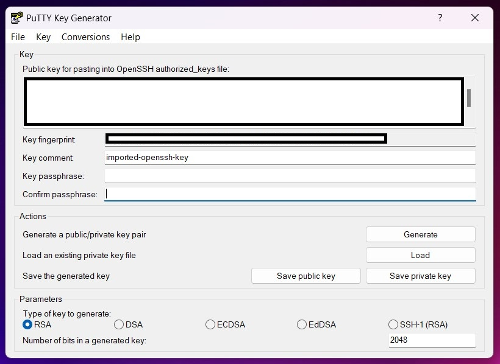
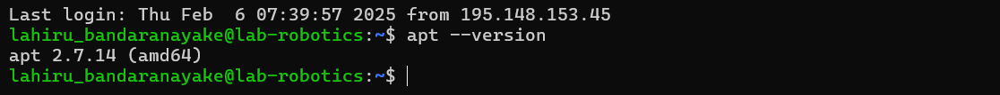
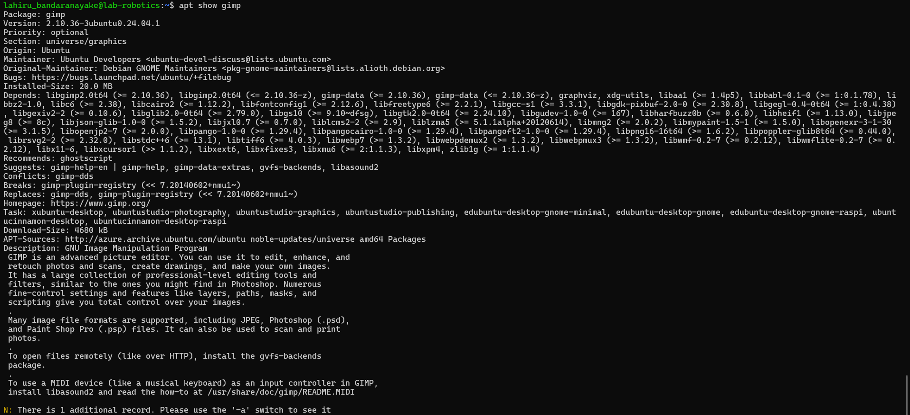
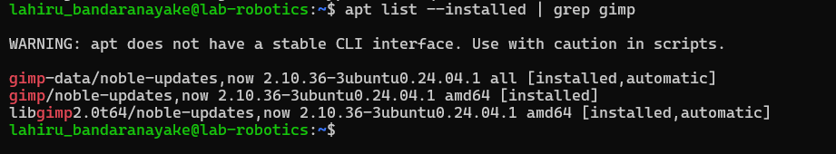
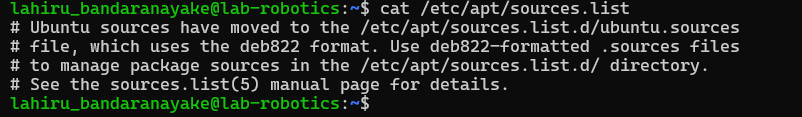
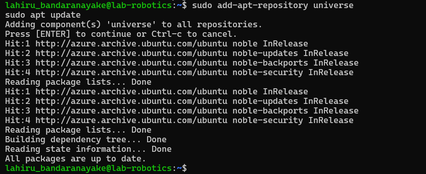
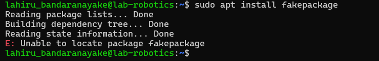
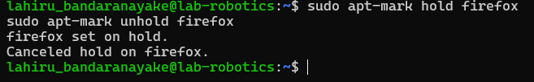

# hamk_linux_management
hamk_linux_management
## Assingment 1
### Azure Virtual Machine Setup
#### I added my HAMK student email to my personal GitHub account by following these two steps:
-I accessed the Settings
-I added the email under the Emails section.

### Azure Account Setup
- Created Azure account using HAMK student email at portal.azure.com
- Activated Azure for Students subscription for additional credits

### Virtual Machine Creation
- Image: Ubuntu Server 24.04 LTS gen 2 (Canonical)
- Name: Ubuntu1-tja-NEur-B1s
- Size: Standard_B2ls_v2
- Authentication: SSH key
- Network: New resource group and subnet created
- Security: Configured to allow SSH traffic from specified IP


### SSH Connection Setup with PuTTY
Converting .PEM to .PPK
- Launched PuTTYgen from Start menu
- Selected RSA as the key type
- Clicked 'Load' and changed file filter to 'All Files'
- Located and selected the .pem file from Azure
- Clicked 'Save private key'
- Confirmed saving without passphrase
- Saved the converted key with .ppk extension



### Establishing SSH Connection
- Opened PuTTY
- Entered VM's public IP address in the Host Name field
- Navigated to Connection > SSH > Auth
- Browsed and selected the converted .ppk key file
- Clicked 'Open' to start the session
- Successfully connected to the VM using the specified username

Connection Verification
- Successfully logged into the Ubuntu VM shell
- Verified system access and basic functionality
- System settings left at default as per instructions

Notes
- VM created according to Microsoft Azure course specifications
- All security best practices followed
- SSH key authentication used for enhanced security


## Assignment_2: List and append

Select five level 2 directories (two levels deep) and save their contents in a file named "listing.md." For each directory, list the filenames within it. Level 2 directories are those two levels deep in the file system (e.g., /home/mylogin/). Exclude level 1 and level 3 directories. The "listing.md" file will contain the directory paths and their filenames.

###### Select five level 2 directories and save their contents in one file, "listing.md". 


sudo ls /etc/{security,selinux,systemd,sos,ssh} > listing.md


##### Listed the files


cat listing.md


## Assignment_3:

This document outlines the steps for creating users and managing permissions in a Linux system.
The tasks involve creating various types of users, configuring sudo privileges, and establishing a shared directory with designated permissions.

### Task 1 Create User Tupu
The adduser script was employed to create the Tupu user. It provides an interactive approach for establishing a new user along with all the necessary directories and configurations.

``` sudo adduser tupu ``` 


### Task 2 Create User Lupu
At first, I attempted to use the following command:

``` sudo useradd -m -d /home/lupu -s /bin/bash -G lupu lupu ```


The problem occurred because we attempted to add the user to a group that hadn’t been created yet. To resolve this, we adjusted the command to include the -U flag, which automatically creates a user group with the same name as the user.

``` sudo useradd -m -d /home/lupu -s /bin/bash -U lupu ```


now, set the security password


### Task 3: Creating System User Hupu
A system user named Hupu was created with limited login permissions


This creates a system account that:

- Uses /bin/false as the login shell, preventing login access
- Is generally used for running services
- Does not have a home directory by default


### Task 4: Sudo privileges
Used the usermod command to grant sudo privileges to both the Tupu and Lupu users.
``` sudo visudo ```

and add

``` tupu ALL=(ALL:ALL) ALL ```

``` lupu ALL=(ALL:ALL) ALL ```
 
 

 An alternative method using the following:

 ``` sudo usermod -aG sudo tupu ```
``` sudo usermod -aG sudo lupu ```


### Task 5:settup shared Directory
This task involved creating a shared directory with specific permissions for both Tupu and Lupu. Below is the detailed solution:

-innitialy, a new group was created for the shared directory:
``` sudo groupadd projekti ```

-Directory

``` sudo mkdir /opt/projekti ```

- Tupu and Lupu were added to the projekti group.

``` sudo usermod -aG projekti tupu ```
``` sudo usermod -aG projekti lupu ```

- Configured group ownership and set the appropriate permissions

``` sudo chown :projekti /opt/projekti ```
``` sudo chmod 2770 /opt/projekti ```


The permission setup (2770) breaks down as follows:

- 2: SetGID bit (ensures that new files and directories inherit the group ownership)
- 7: Owner has full permissions (read, write, execute)
- 7: Group has full permissions (read, write, execute)
- 0: Others have no permissions

This configuration ensures that:

- Only Tupu and Lupu (the owner and group members) can access the directory
- Any new files created within the directory will automatically inherit the group ownership of "projekti"
- No other users have access to the directory
- Both Tupu and Lupu have full control over the directory and its contents

To verify settings 

``` sudo ls -la /opt/projekti ```


## Assignment_5: List and append
In this assignment, we developed a shell script called print.sh to append a line to the file diskspace.txt, containing the size of the home directory along with the current date and time. We then configured the script to run every 12 hours using crontab, ensuring that it executed at least six times to generate multiple entries in diskspace.txt. To identify the entry with the largest value in the first column, we employed an awk command to extract the line with the maximum value and displayed it in the format: Max=[maximum value], at [date and time]. This task enabled us to automate disk space monitoring and efficiently identify the largest recorded value.

### Step 1: Make a script and add it to cron


## Assignment_6: List and append
This report details the hands-on exploration of the Advanced Package Tool (APT) on a Linux system, focusing on system updates, package management, repository configuration, and troubleshooting techniques

### Part 1: Understanding APT & System Updates

**APT Version Check**

Command :

```apt --version ```




**Package List Update**
Command :

```sudo apt update```

This step is important because:

- Synchronizes the local package index with remote repositories.
- Ensures the system has up-to-date information on available packages.
- Is required before installing or upgrading any packages.
- Helps identify packages that need updating.


**System Upgrade**

Command :

```sudo apt upgrade -y```

1. apt update:

- Refreshes the package index and metadata.
- Checks for the latest available package information.
- Does not install or update any packages.
- It's like checking what's new in the software repository.

2. apt upgrade:

- Downloads and installs newer versions of installed packages.
- Upgrades the software to the latest available version based on the updated package information.
- Actually applies the updates and changes to your system.


**Pending Updates Check**

Command :

```apt list --upgradable```


### Part 2: Installing & Managing Packages
**Package Search**

Command :

```apt search image editor```



Key dependencies:

- libc6
- libgdk-pixbuf2.0-0
- libgegl-0.4-0t64
- libgimp2.0t64
- libgtk2.0-0t64


**Package Installation**

Command :

```sudo apt install gimp -y```

The installation was successful, confirmed by launching the application.


**Version Check**

Command :

```apt list --installed | grep gimp```



### Part 3: Removing & Cleaning Packages


**Package Removal**

Command :

```sudo apt remove gimp -y```

Note: This removes the package but keeps configuration files.


**Complete Package Purge**

Command :

```sudo apt purge gimp -y```

Here’s the difference between remove and purge in a point-wise format:

1. remove:
- Uninstalls the package binaries.
- Leaves the configuration files behind.
- The package's settings remain on the system.

2. purge:
- Removes both the binaries and the configuration files.
- Completely removes all traces of the package, including settings and preferences.
- More thorough if you want to fully erase a package from your system.


**Autoremove Unused Dependencies**

Command :

```sudo apt autoremove -y```

This step is important because:
- It removes unnecessary packages installed as dependencies.
- It helps free up disk space.
- It keeps the system clean by eliminating unused software.


**Clean Package Cache**

Command executed:

```sudo apt clean```

In this steps
- Deletes all downloaded .deb package files from the local cache.
- Frees up disk space in /var/cache/apt/archives/.
- Does not impact any installed packages.

### Part 4: Managing Repositories & Troubleshooting

**Repository List**

Command :

```cat /etc/apt/sources.list```



Observations:

- Includes the main Ubuntu repositories.
- Comprises various components (main, restricted, universe, multiverse).
- Lists both source and binary package repositories.
- Contains repositories for security updates.


**Adding Universe Repository**

Command :

```sudo add-apt-repository universe```
```sudo apt update```



The Universe repository includes:

- Packages maintained by the community.
- Open-source software not officially supported by Ubuntu.
- A broader range of packages than the main repository.
- Software that may have more frequent updates.


**Installation Failure Simulation**

Command :

```sudo apt install fakepackage```



Troubleshooting steps:

- Verify the spelling of the package name.
- Ensure the required repository is enabled.
- Run apt update to refresh the package lists.
- Use apt search to look for similar package names.
- Consider using alternative package names or sources.


**Bonus Challenge: Package Hold Management**

Commands :

```sudo apt-mark hold firefox```
```sudo apt-mark unhold firefox```




Reasons to hold a package:

- Stop automatic updates for critical production software.
- Ensure compatibility with specific software versions.
- Prevent potential issues caused by updates.
- Maintain a stable environment for particular applications.

Conclusion

This assignment has provided practical experience with APT package management, including:

- Performing system updates and upgrades.
- Installing and removing packages.
- Managing repositories.
- Troubleshooting common issues.
- Utilizing advanced package management techniques.
- These skills are crucial for efficiently maintaining and managing Linux systems.